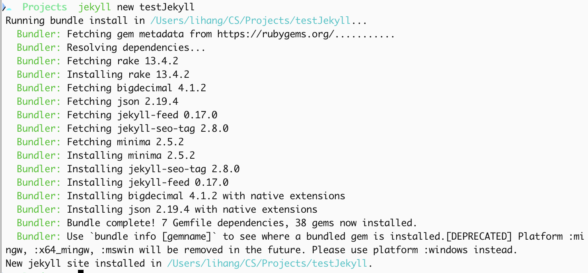

## 个人博客网站搭建

​	最近计划在后续工作中系统性记录技术知识，所以想搭建一个简易的博客，但是又不想花钱，就去找了相关的方案，最后发现GitHub Pages挺不错的，主要是基于以下两个原因

- GitHub是最大的、开源的技术网站，遇到相关问题方便查阅资料
- 搭建简单、免费

最终选择使用GitHub Pages+Jekyll搭建一个简易的个人博客，

### GitHub Pages

​	GitHub Pages 是一项静态站点托管服务，它直接从 GitHub 上的存储库获取 HTML、CSS 和 JavaScript 文件，（可选）通过构建过程运行文件，然后发布网站。具体搭建方式就很简单了：

- 首先登陆Github网站，这里需要确保自己有一个账号，没有注册一个即可
- 进入Github主页后，创建一个项目即可
- 仓库的信息按照要求创建即可（仓库名必须为`{userName}.github.io`的形式）

- 创建后clone项目到本地即可，整个时候在项目根目录下创建一个index.html后提交，再访问`https://<username>.github.io`即可看到index.html的内容。 GitHub Pages 将查找 `index.html`、`index.md` 或 `README.md` 文件，作为站点的入口文件。

### Jekyll

​	Jekyll 是一个静态站点生成器，内置 GitHub Pages 支持和简化的构建过程。 Jekyll 使用 Markdown 和 HTML 文件，并根据选择的布局创建完整静态网站。下面以MACOS为例说明安装流程

1. 安装Ruby：`brew install ruby`（MAC系统自带Ruby，但是会有权限问题和版本差异，建议使用brew创建一个新的后配置环境变量）

2. 更新Ruby镜像

   ```
   gem sources --add https://gems.ruby-china.com/ --remove https://rubygems.org/
   gem sources -u
   ```

3. 安装bunder：`gem install bunder`

4. 安装jekyll: `gem install jekyll` 

5. 安装`Github pages`：`gem install github-pages`

6. 环境变量配置：

   ```shell
   export PATH="/opt/homebrew/opt/ruby/bin:$PATH"
   export PATH="/opt/homebrew/lib/ruby/gems/4.0.0/bin:$PATH"
   ```

7. 初始化项目`jekyll new projectName`：新建一个文件夹，并自动在里面生成一个完整的 Jekyll 博客项目

   

   项目初始化后结构：

   ```
   lhwj.github.io/
   ├── _config.yml          # 配置（theme: minima）
   ├── _posts/              # 博客文章
   │   ├── 2025-05-01-agent.md
   │   ├── 2025-05-01-cors.md
   │   └── 2025-05-01-tools.md
   ├── about.md             # 关于页面
   ├── index.md             # 首页
   ├── Gemfile              # Ruby 依赖
   └── README.md
   ```

8. 本地启动jekyll服务`jekyll serve --watch`：开启`Jekyll`本地服务，默认情况下，该服务会侦听在本地`4000`的端口上，可以打开浏览器访问`http://127.0.0.1:4000`，这样就可以在本地查看自己的博文效果了。

